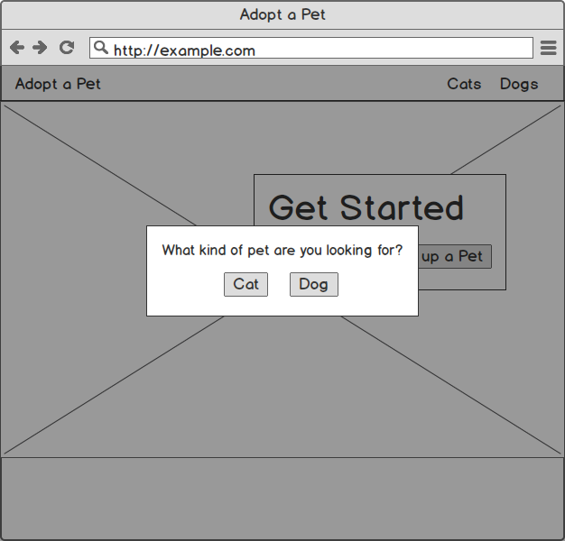
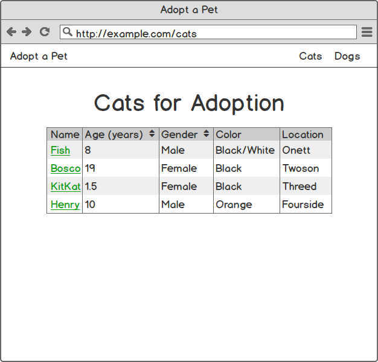
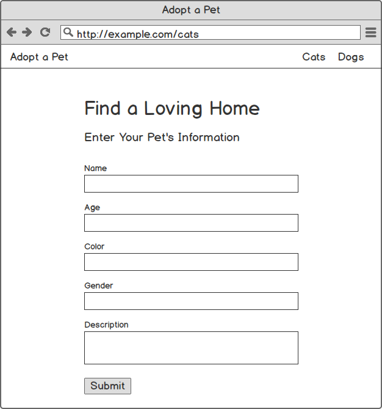
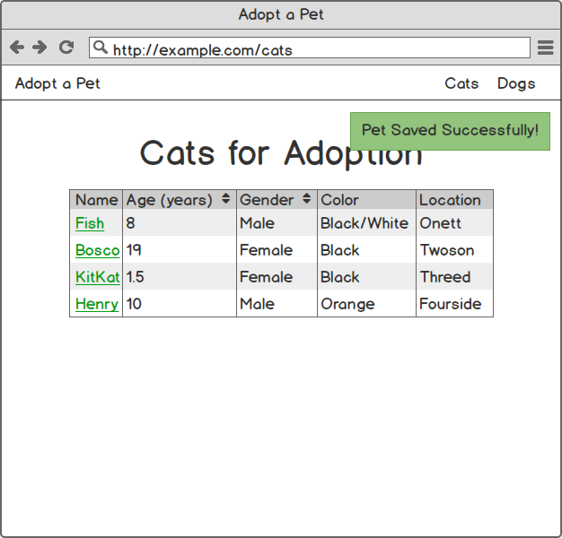
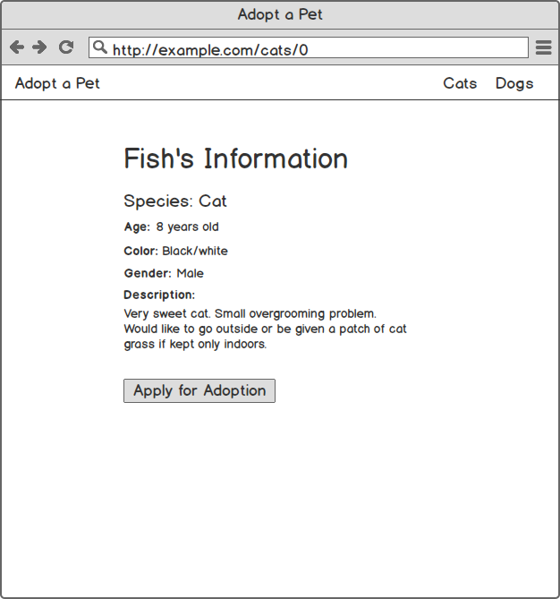

# Repo comparing Vue.js Component Libraries

This repo was created from the [Vue Adopt Pets](https://github.com/gwenf/vue-adopt-pets) tutorial code that I created with Bootstrap Vue. It is now being used to compare Vue Component libraries by building same Vue app with each diffrent library. Feel free to raise an issue or contribute.

This is still in the early stages and needs a lot more work.

## Project Details

Each folder in this repo represents a different UI component library for Vue.js.

## Running Locally

1. Clone this repo.
1. Navigate into one of the directories in the parent folder (e.g. `cd inkline-vue/`).
1. Install dependencies: `npm install`
1. Run the Vue application: `npm run serve`
1. Go to http://localhost:8080 in your browser to see the live application

## Mockups

*apply for adoption section is coming soon*
