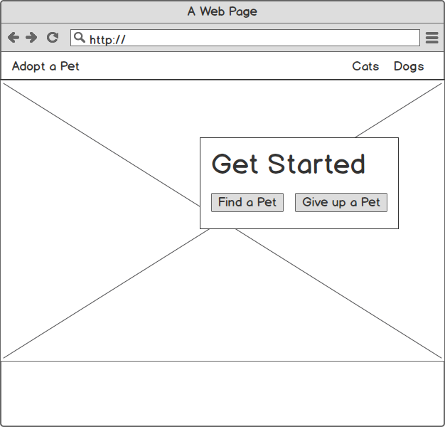

# Repo comparing Vue.js Component Libraries

This repo was created from the [Vue Adopt Pets](https://github.com/gwenf/vue-adopt-pets) tutorial code that I created with Bootstrap Vue. It is now being used to compare Vue Component libraries by building same Vue app with each diffrent library. Feel free to raise an issue or contribute.

This is still in the early stages and needs a lot more work.

## Mockups

## Project Specs

*Coming soon...*

